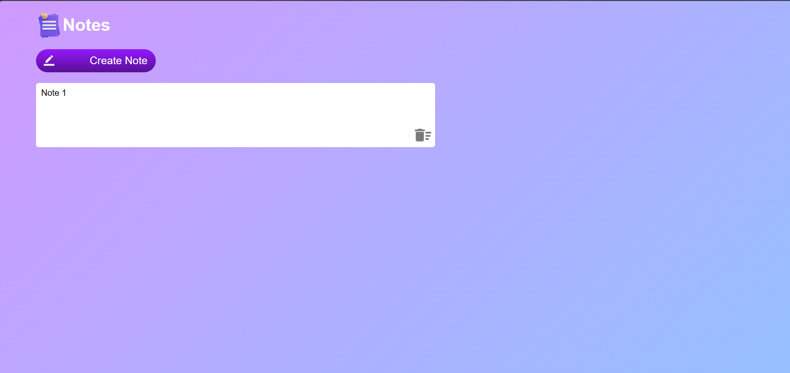

# Note App

## Overview

The Note Management App is a web application that allows users to manage and store notes. This app provides a simple and intuitive interface for creating, editing, and deleting notes. Notes are persisted in the user's local browser storage, ensuring data is saved even after the browser is closed.

## Key Features

- **Add and Edit Notes:** Easily create new notes or edit existing ones with a user-friendly interface.

- **Delete Notes:** Delete unwanted notes by clicking on the delete icon.

- **Local Storage:** Notes are stored in the browser's local storage, providing persistence between sessions.


## Technologies Used

- HTML
- CSS
- JavaScript

## Usage

1. Clone this repository to your local machine.

```bash
git clone https://github.com/yourusername/note-management-app.git




